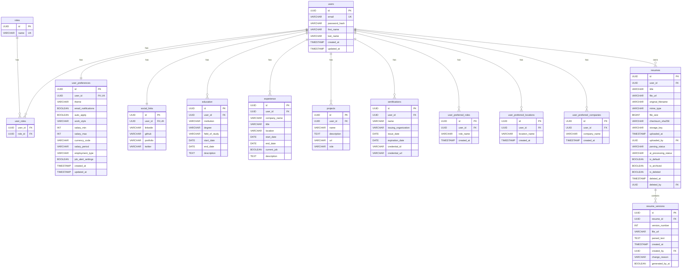
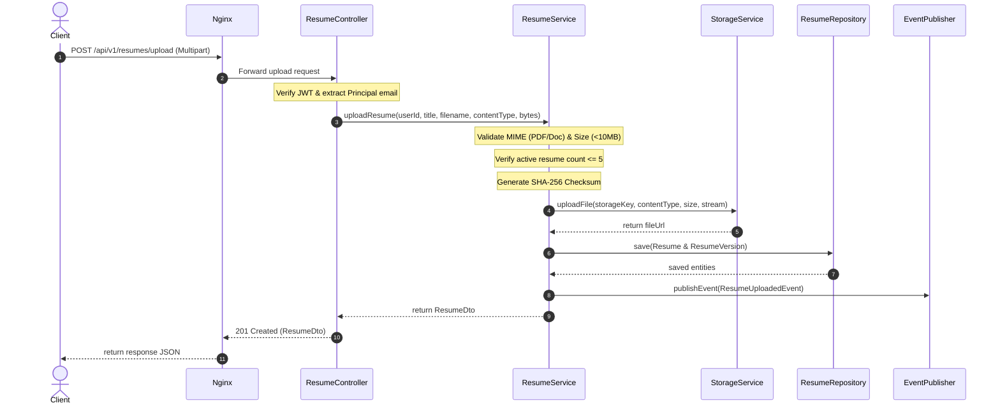
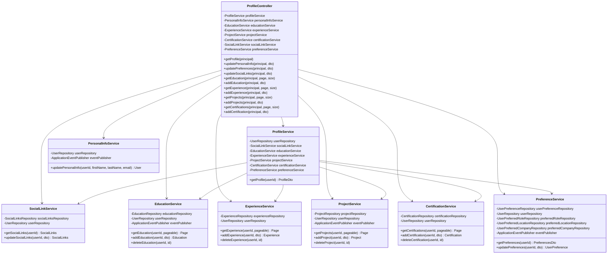

# CareerPilot OS - Milestone 2 Architecture Diagrams

This document contains ER diagrams, sequence diagrams, and class mappings for Milestone 2 features (User Profiles, Resumes Storage, and Normalized Job Preferences).

---

## 1. Entity Relationship (ER) Diagram

This diagram maps out the PostgreSQL database structures. All major entities utilize UUID primary keys, and junction mappings are fully normalized.

---

## 2. Sequence Diagram (Resume Upload Flow)

This diagram details the transactional, validation, storage (MinIO), and event flow during resume uploading:

---

## 3. Class Diagram (Profile Service Separation)

This diagram maps out our clean service separation in the Profile module:

