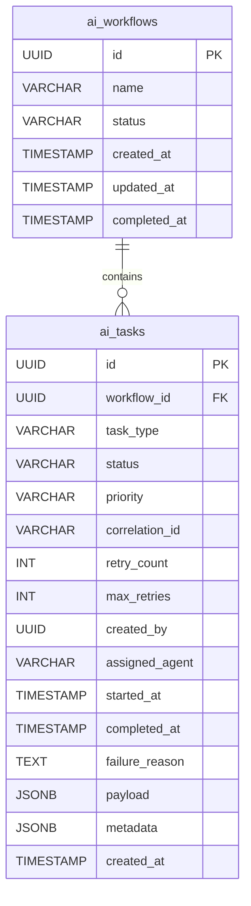
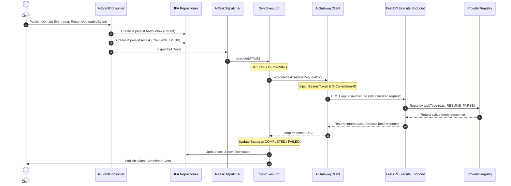
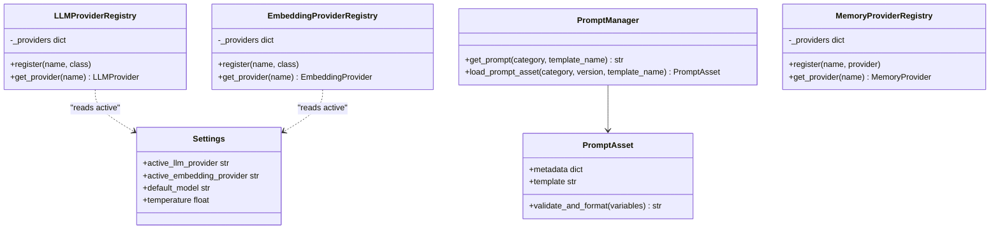

# CareerPilot OS - Milestone 3 AI Foundation Architecture Diagrams

This document contains ER diagrams, sequence diagrams, and class mappings for Milestone 3 (AI Foundation Infrastructure: Workflows, Tasks, Registries, and Prompt Assets).

---

## 1. Database Schema (Workflows & Tasks)

This diagram details the PostgreSQL tables for workflows and tasks, supporting JSONB payloads and metadata.

---

## 2. Sequence Diagram (Event-Driven Task Dispatching)

This diagram outlines how domain events spark new AI workflows and tasks, routing them to the Gateway and python AI Service:

---

## 3. Class Diagram (FastAPI Registry & Prompt Framework)

This diagram outlines how Python FastAPI services use provider registries, hot settings routing, and versioned Prompt Assets:

