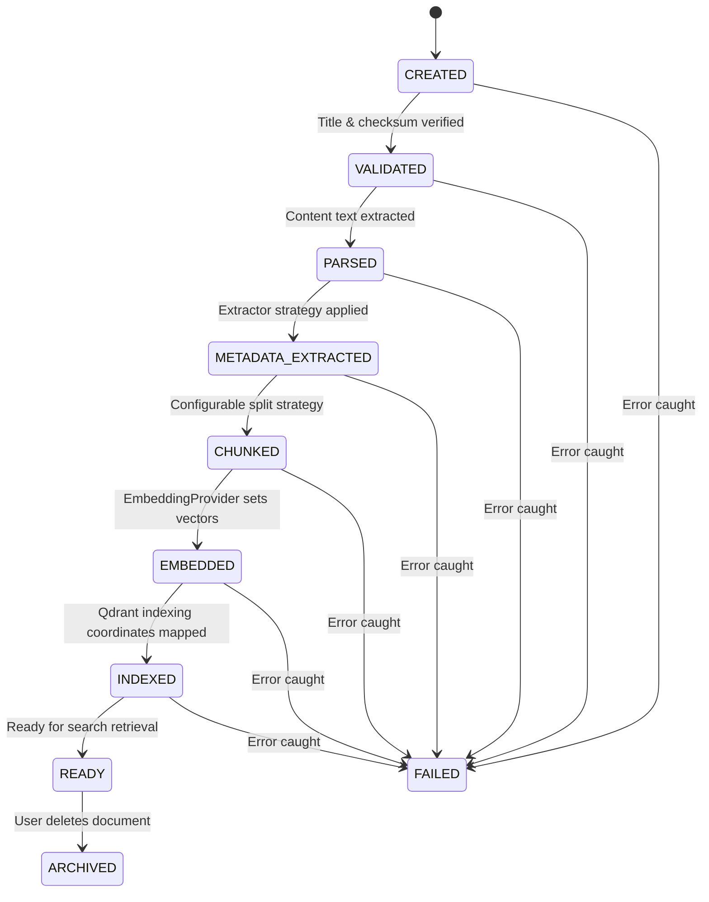
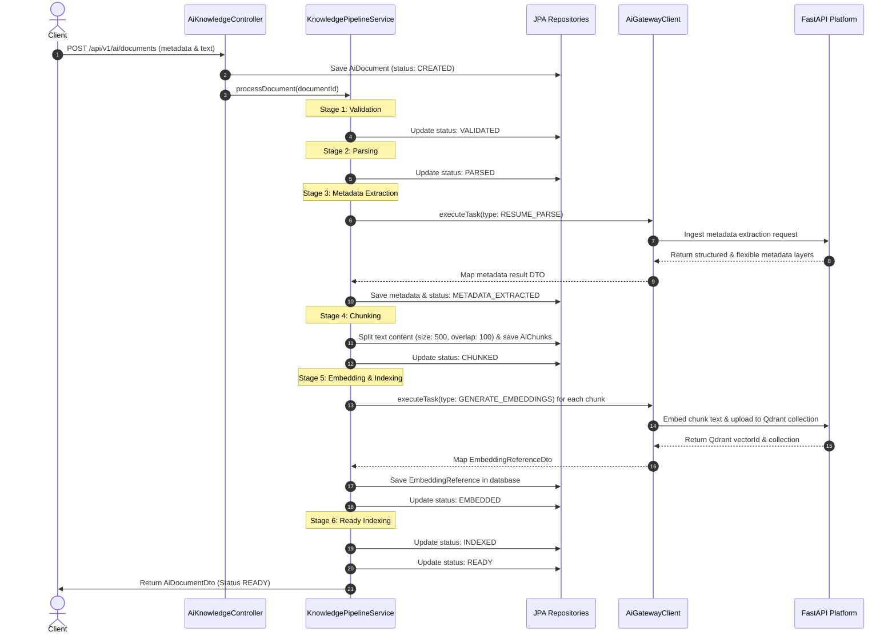
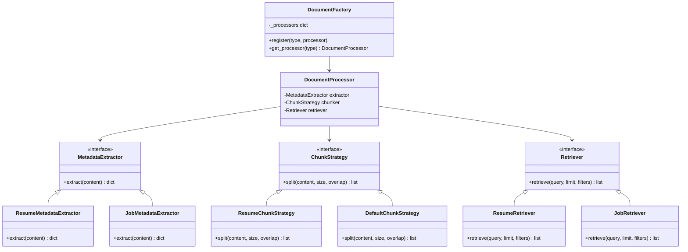

# CareerPilot OS - Milestone 4 AI Knowledge Platform Architecture Diagrams

This document contains ER diagrams, sequence diagrams, and class mappings for Milestone 4 (AI Knowledge Platform: Processing Pipeline, Lifecycle, Factories, and Retrievers).

---

## 1. Document Lifecycle State Machine

This diagram maps out the document processing lifecycle states. Transition triggers are persisted to PostgreSQL:

---

## 2. Sequence Diagram (Pipeline Execution Flow)

This diagram details the execution pipeline stages:

---

## 3. Class Diagram (Knowledge Core Components)

This diagram outlines how Python FastAPI services use chunk split strategies, metadata extractors, document factories, and retrievers:

---

## 4. Qdrant Collection Strategy

Vectors are kept in isolated Qdrant vector databases according to document type:
- `resume_vectors` (dimensions: 1536/384)
- `company_vectors` (dimensions: 1536/384)
- `job_vectors` (dimensions: 1536/384)
- `interview_vectors` (dimensions: 1536/384)
- `conversation_vectors` (dimensions: 1536/384)
- `default_vectors` (dimensions: 1536/384)
