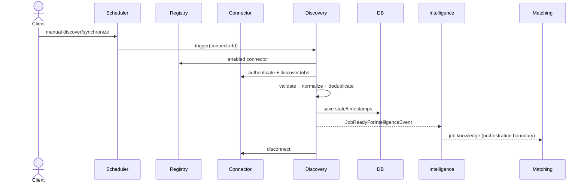

# Connector SDK & Job Discovery Engine (Milestone 9)

## Architecture
The provider-neutral Java SDK lives in `packages/connector-sdk/java` and defines the complete lifecycle: authenticate, discover, normalize, synchronize, health-check, and disconnect. Provider code remains behind `Connector`. Spring discovers connector beans and `ConnectorRegistry` handles registration, versions, enablement, lookup, and health.

## Discovery pipeline
`DiscoveryScheduler` (manual or periodic) → `JobDiscoveryService` → connector → canonical validation → `TaxonomyNormalizer` → deterministic duplicate detection → persistence/synchronization events → `JobIntelligencePort`. The port publishes `JobReadyForIntelligenceEvent`; an intelligence/matching orchestration listener can consume it. Connectors never invoke matching.

## Canonical model
`DiscoveredJob` contains externalId, connectorId, source/sourceUrl, title, company, location, employmentType, workMode, salary, postedDate, rawContent, and metadata. Derived fields include normalized title/company, taxonomy skills/technologies, discovery time, and SHA-256 content hash. Connector-specific DTOs cannot cross the SDK boundary.

## Synchronization
Each `(connectorId, externalId)` is unique. A first sighting is `NEW`; a changed hash is `UPDATED`; an identical hash is `UNCHANGED`; a previously stored ID absent from a successful snapshot becomes `REMOVED`; invalid items and connector exceptions are counted as `FAILED`. `lastSeenAt`, `updatedAt`, and `discoveredAt` retain lifecycle timestamps. Unchanged jobs bypass intelligence processing.

## Health and monitoring
`GET /api/v1/discovery/connectors/health` calls connector health implementations. Health includes status, last synchronization/success/failure, response time, and failure count. Actuator Prometheus exposes `careerpilot.discovery.jobs.discovered`, `jobs.updated`, `duplicates`, `connector.failures`, connector latency, and synchronization duration.

## Sequence

## API
- `POST /api/v1/connectors/register` enables an already discovered plugin by `connectorId` and `enabled`.
- `GET /api/v1/connectors`, `GET /api/v1/connectors/{id}`
- `POST /api/v1/connectors/{id}/discover`, `POST /api/v1/connectors/discover-all`
- `GET /api/v1/discovery/jobs`, `GET /api/v1/discovery/jobs/{id}`
- `GET /api/v1/discovery/connectors/health`
- `POST /api/v1/discovery/synchronize`

## Implementing a connector
1. Depend on `:packages:connector-sdk` and implement `Connector`.
2. Give the instance a stable ID and semantic version; expose it as a Spring bean/plugin.
3. Keep credentials and provider DTO mapping inside the implementation.
4. Return only valid canonical `DiscoveredJob` values; external IDs must be stable.
5. Implement health statistics and idempotent disconnect. Avoid application submission behavior.
6. Unit-test empty pages, authentication/provider failure, mapping, and pagination. Integration-test registration and two consecutive snapshots.

Webhook triggering is intentionally an extension point. Fuzzy matching may later be added behind `DuplicateDetector` without changing connectors.
